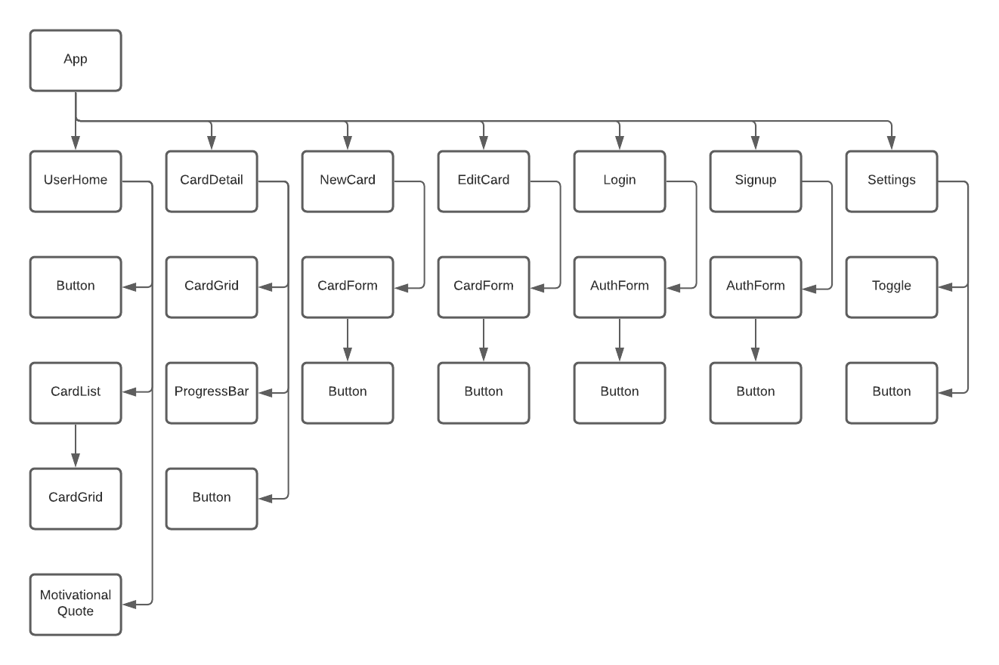

# The X Effect

## [Reddit Wiki](https://www.reddit.com/r/theXeffect/wiki/index)

The X Effect is a habit-building method first introduced to [r/getdisciplined](https://www.reddit.com/r/getdisciplined/comments/1x99m6/im_a_piece_of_shit_no_more_games_no_more_lies_no/cf9dz72/) by [u/Bombjoke](https://www.reddit.com/user/Bombjoke/) back in 2014. The idea is to set a goal of doing a specific, simple thing every day for 50 days in order to build a new habit. Originally, u/Bombjoke suggested using an index card divided into a 7x7 grid, and putting a big red X in each square for each day you do the thing. If you miss a day, leave that square blank. Once the card is finished, that's 49 squares. The 50th day is one giant X across the whole card.

This app is meant to accomplish the same task as the index cards, but with a little more customization. Grids can be of varying sizes, and notes can be added to specific boxes in case you want to track *why* you missed a day. 

## MVP Goals

1. Users can create x-effect cards to track daily habits
1. User can update daily status and add notes to cards
1. User can adjust preferences: dark mode and color scheme
1. Users can edit cards
1. Mobile view
1. Front-end routing

## PostMVP Goals

1. Users can choose starting day and duration for cards
1. User authentication
1. Responsive design - desktop view
1. Progress bar
1. Motivational quote

## Wireframes


## Backend Planning

Using Express and MongoDB because Mongo databases are so easily scalable and this app will likely grow in the future. 

### Schema

``` 
User Schema
- email address
- password
- Cards
    - Title
    - Description
    - Start Date
    - End Data
    - Success fill
    - Missed fill
    - Notes fill
    - Days
        - Success
        - Notes 
```

## Frontend Planning

Using ReactJS because it is great for creating responsive single-page applications.

### Component Heirarchy



#### Component Breakdown

|  Component   | State | Description                                                      |
| :----------: | :---: | :--------------------------------------------------------------- |
| UserHome |  | _Home page displays user's cards in a list_ |
| CardDetail |  | _Detailed view of individual card with progress bar_ |
| NewCard |  | _Allows user to create new card_ |
| EditCard |  | _Allows user to edit existing card_ |
| Login |  | _User login screen_ |
| Signup |  | _New user registration screen_ |
| Settings |  | _Users can edit preferences like dark mode and color theme_ |
| Button |  | _Reusable button_ |
| CardList |  | _Displays the existing cards as a list_ |
| CardGrid |  | _X-Effect Card_ |
| Motivational Quote |  | _Displays a random motivational quote from (insert API)_ |
| ProgressBar |  | _Displays user's current progress for specific card_ |
| CardForm |  | _Form for creating and updating existing cards_ |
| AuthForm |  | _Form for user login and signup_ |
| Toggle |  | _Toggle switch used for settings_ |

### MVP Tech Stack

| Library/Framework | Description |
| :--------------: | :----------------------------------------- |
| MongoDB | _Back End database_ |
| Express | _Back End server framework_ |
| React | _Front End_ |
| React Router | _Front End routing_ |
| Axios | _API calls_ |
| Mongoose | _MongoDB ORM_ |
| TailwindCSS | _Styling_ |

### Endpoints

Admin/Auth routes:
- GET `/users`
	- Index route returning an array of all Users and associated listings
- GET `/users/:id`
	- Show route for a user requested by ID
- PUT `/users/:id`
  - Update a users info by id
- DELETE `users/:id`
  - Delete user by id

User routes:
- GET `/profile`
	- Returns logged-in user's profile
- POST `/users`
	- Create route for a new user
- GET `/cards`
  - Index route to return all cards for logged-in user
- GET `/cards/:id`
  - Returns info for specific card
- POST `/cards`
  - Create new card
- PUT `/cards/:id`
  - Edit card
- DELETE `/cards/:id`
  - Delete card
- PUT `/profile`
  - Edit user settings
- PUT `/cards/:id/days/:day_id`
  - Edit day fill color and notes

## Anticipated Challenges

1. Authentication - put in PostMVP because we anticipate this being difficult.
1. Making the card grid user-friendly and functional
1. MongoDB - new tech
1. Setting a start day and duration for the cards
1. Formik - new tech

## Changelog

<!-- for future changes -->

## Progress Notes

- secure backend routes
- secure frontend routes
